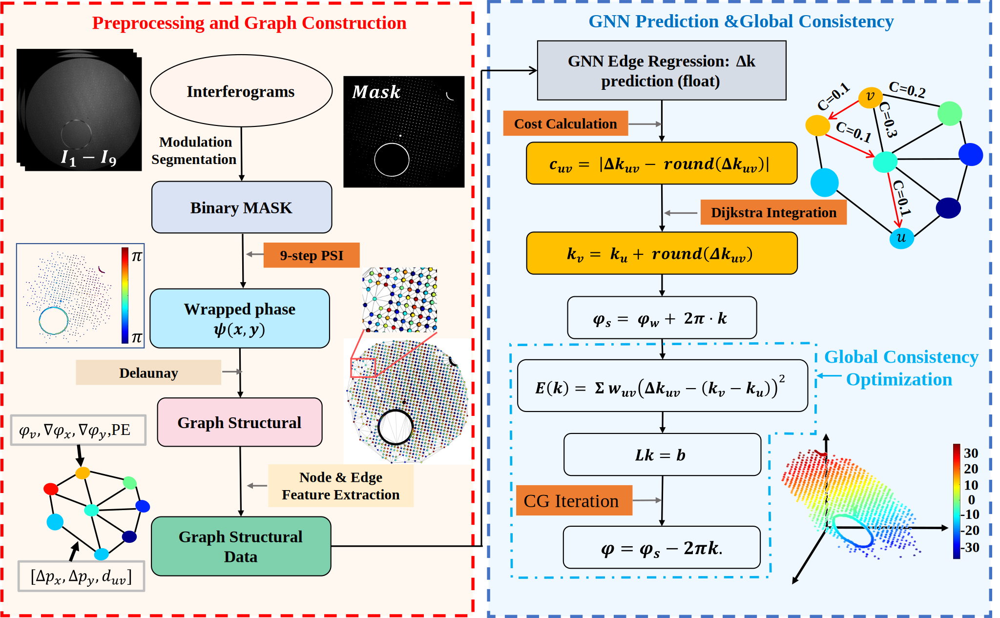

# Graph Neural Network-Based Phase Unwrapping (GNNPU)

[](https://opensource.org/licenses/MIT)
[](https://www.python.org/downloads/release/python-380/)
[](https://pytorch.org/)
[](https://pytorch-geometric.readthedocs.io/en/latest/)

This repository provides the **official PyTorch implementation** of the paper:

> **Graph Neural Network-Based Phase Unwrapping for Sparse Discontinuous Surfaces in Laser Interferometry**  
> *Zhenxin Xin, Ping Zhong*  
> Submitted to *Optics and Lasers in Engineering* (*****)
> The source code and pretrained models will be released upon the paper’s acceptance.
---

## 🌟 Overview

**GNNPU** introduces a novel graph neural network framework for phase unwrapping on sparse and discontinuous surfaces.  
By constructing a **Delaunay graph** from sparse points and leveraging **Graph Attention Networks **, GNNPU predicts **wrap count differences** along edges and integrates them to reconstruct a globally consistent phase map.

<p align="center">
  
</p>
<p align="center">
  <em><b>Fig. 1</b>: GNNPU workflow. From a sparse wrapped phase (left), a Delaunay graph is constructed.  
  The GNN predicts wrap count differences on edges, which are then integrated to yield a continuous unwrapped phase (right).</em>
</p>

---

## ⚙️ Installation

### 1. Clone the repository
```bash
git clone https://github.com/ttxsg/Graph-Neural-Network-Based-Phase-Unwrapping.git
cd Graph-Neural-Network-Based-Phase-Unwrapping
````

### 2. Create the environment

```bash
conda create -n gnnpu python=3.8
conda activate gnnpu
```

### 3. Install dependencies

Install PyTorch and PyTorch Geometric according to your CUDA version.

**Example (for CUDA 11.7):**

```bash
# PyTorch
pip install torch==1.13.1+cu117 torchvision==0.14.1+cu117 torchaudio==0.13.1 --extra-index-url https://download.pytorch.org/whl/cu117
# PyG
pip install pyg_lib torch-scatter torch-sparse torch-cluster torch-spline-conv -f https://data.pyg.org/whl/torch-1.13.1+cu117.html
# Other dependencies
pip install -r requirements.txt
```

---

## 📦 Dataset & Pre-trained Model

Download the pre-processed dataset and pre-trained model from:
[➡️ **Google Drive (Link Here)** ⬅️]

Unzip and place the contents into the project root.
Expected structure:

```
.
├── checkpoints/
│   └── gnnpu_pretrained.pth
├── data/
│   └── sparse_dataset_1018/
│       ├── train/
│       │   ├── sample_001.mat
│       │   └── ...
│       └── test/
│           ├── sample_001.mat
│           └── ...
└── ...
```

Each `.mat` file contains:

* `wrapped_phase` — the wrapped phase map
* `true_phase` — the corresponding ground truth phase map

---

## 💻 Usage

### Training

Train GNNPU from scratch:

```bash
python train.py
```

All hyperparameters are configurable in `train.py`.
The best model weights will be automatically saved (default: `train3_927_11_28_data_all.pth`).

### Inference

Run inference on a single `.mat` file:

```bash
python inference.py \
    --model_path "checkpoints/gnnpu_pretrained.pth" \
    --input_path "data/sparse_dataset_1018/test/sample_001.mat" \
    --output_path "results/unwrapped_sample_001.png"
```

This will generate and save a visual comparison of the wrapped input, ground truth, and unwrapped result.

---

## 🧠 Model Architecture

The proposed **EdgeRegressionGNN_v2** consists of stacked **GATv2Conv** layers with edge-aware attention.
Main features include:

* **Hybrid Node Representation:** Combines local physical features (e.g., phase gradients) with absolute positional encodings.
* **Edge-Aware Attention:** Incorporates relative distance and orientation as edge attributes for wrap count prediction.
* **Deep GNN Structure:** Six-layer GATv2 architecture for long-range dependency modeling.
* **Edge Regression Head:** Predicts wrap count difference between node pairs to achieve fine-grained unwrapping.

---

## 📚 Citation

If you find this work useful in your research, please consider citing:

```bibtex
@article{xin2024gnnpu,
  title   = {Graph Neural Network-Based Phase Unwrapping for Sparse Discontinuous Surfaces in Laser Interferometry},
  author  = {Zhenxin Xin and Ping Zhong},
  journal = {Optics and Lasers in Engineering},
  year    = {2025},
  note    = {(Under review)}
}
```

---

## 📄 License

This project is licensed under the **MIT License**.
See the [LICENSE](LICENSE) file for details.

---

## 🧩 Acknowledgments

This work was supported by the *Key Laboratory of Optoelectronic Detection Technology, Ministry of Education*, and *Qianyao Optoelectronics Company* for providing phase-shifting interferometry data and system support.

---

## 📬 Contact

For questions, please contact:
📧 **Zhenxin Xin** — [[386857251@qq.com]]
or open an issue on GitHub.

```

---
